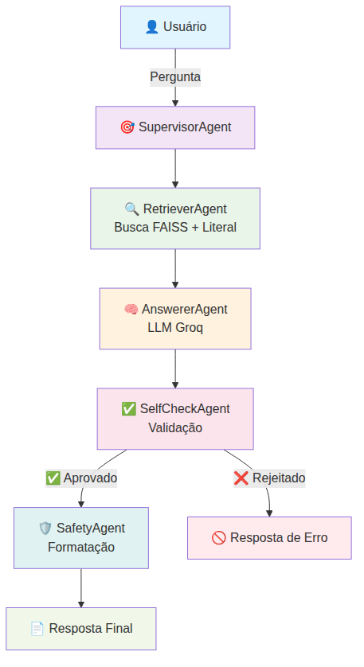

# 🏢 Assistente do Plano Diretor de Campina Grande

**Sistema RAG + Agentes para Consulta Inteligente de Documentos Legislativos**

[](https://python.org)
[](https://langchain.com)
[](https://opensource.org/licenses/MIT)
[](https://streamlit.io)

---

## 📋 Sumário
- [Visão Geral](#-visão-geral)
- [Características](#-características)
- [Arquitetura](#-arquitetura)
- [Instalação](#-instalação)
- [Uso](#-uso)
- [Estrutura do Projeto](#-estrutura-do-projeto)
- [Agentes Especializados](#-agentes-especializados)
- [Avaliação](#-avaliação)
- [Limitações](#-limitações)
- [Contribuição](#-contribuição)
- [Licença](#-licença)

---

## 🎯 Visão Geral

Este projeto implementa um assistente inteligente especializado na consulta ao **Plano Diretor de Campina Grande**, utilizando técnicas avançadas de **Retrieval-Augmented Generation (RAG)** e orquestração de agentes via **LangGraph**.

O sistema foi desenvolvido como prova de conceito para democratizar o acesso à legislação urbana, permitindo que cidadãos, técnicos e gestores públicos obtenham informações precisas e citadas sobre diretrizes de desenvolvimento urbano.

### 🎓 Contexto Acadêmico
**Projeto Final - Disciplina de LLM**  
**Universidade: Universidade Federal de Campina Grande (UFCG)**
**Autor: Lucas de Sousa Pereira**  
**Orientador: Leandro Balby**  
**Ano: 2025**

---

## ✨ Características

### **Busca Inteligente**
- **Busca Híbrida:** Combinação de busca literal (artigos específicos) + busca semântica
- **Indexação Especializada:** Reconhecimento automático de estruturas legais (Art. 175, Art. 178, etc.)
- **Ranking Inteligente:** Priorização de resultados mais relevantes por similaridade

### **Sistema Multi-Agente**
- **Orquestração Inteligente:** 5 agentes especializados trabalhando em conjunto
- **Self-Check Automático:** Validação de qualidade e evidências antes da resposta
- **Controle de Alucinação:** Rejeição de respostas sem evidências suficientes

### **Transparência e Confiabilidade**
- **Citações Obrigatórias:** Todas as afirmações incluem referências [1], [2], [3]
- **Rastreabilidade Completa:** Links para páginas específicas dos documentos
- **Disclaimers Automáticos:** Avisos contextuais sobre limitações e uso adequado

### **Interface Amigável**
- **Streamlit Web App:** Interface intuitiva e responsiva
- **Chat Interativo:** Histórico de conversas e respostas contextualizadas
- **CLI Opcional:** Para uso em terminal e automação

---

## 🏗️ Arquitetura

### Fluxo de Processamento


### Stack Tecnológica

| Categoria | Tecnologia | Versão | Propósito |
|-----------|------------|--------|-----------|
| **Orquestração** | LangGraph | 0.1+ | Workflow de agentes |
| **LLM** | Groq API | - | Geração de respostas |
| **Embeddings** | SentenceTransformers | 2.3+ | Representação vetorial |
| **Vector Store** | FAISS | 1.8+ | Busca por similaridade |
| **Interface** | Streamlit | 1.31+ | Interface web |
| **Documentos** | PyPDF | 4.0+ | Processamento de PDFs |

---

## 🚀 Instalação

### Pré-requisitos
- **Python 3.10+**
- **Git**
- **Chave API da Groq** ([obter aqui](https://groq.com))

### 1. Clone do Repositório
```bash
git clone https://github.com/lucas-s-p/agent-plano-diretor
cd agente_educacional_ti
```

### 2. Ambiente Virtual
```bash
python -m venv venv

# Linux/Mac
source venv/bin/activate

# Windows
venv\Scripts\activate
```

### 3. Instalação de Dependências
```bash
pip install -r requirements.txt
```

### 4. Configuração da API
```bash
# Criar arquivo .env na raiz do projeto
echo "GROQ_API_KEY=sua_chave_groq_aqui" > .env
```

### 5. Indexação dos Documentos
```bash
python3 ingest/ingest.py ingest/docs
```

### 6. Teste da Instalação
```bash
python3 ingest/ingest.py --test
```

---

## 💻 Uso

### Interface Web (Streamlit)
```bash
streamlit run app/streamlit_app.py
```

Abrir: `http://localhost:8501`

### Interface CLI
```bash
python src/main.py
```

### Exemplos de Pergunta e Resposta

```
🔍 Pergunta: "O que diz o Art. 175 sobre cidades inteligentes?"

📋 Resposta:
O Art. 175 estabelece as diretrizes fundamentais para o desenvolvimento 
de cidades inteligentes em Campina Grande, definindo a integração de 
tecnologias digitais com o planejamento urbano [1]. O artigo prevê a 
implementação de sistemas integrados de gestão urbana, promovendo a 
eficiência dos serviços públicos através de soluções tecnológicas 
inovadoras [2].

📚 Fontes:
[1] Plano Diretor de Campina Grande, Art. 175, p. 87
[2] Lei Complementar Nº 003/2006, Art. 175, §2º, p. 88

⚠️ Este é um sistema informativo. Para decisões oficiais, consulte 
sempre a legislação original.
```

---

## 📁 Estrutura do Projeto

```
assistente-plano-diretor-cg/
├── 📁 app/
│   └── streamlit_app.py          # Interface Streamlit
├── 📁 src/
│   ├── agent_educacional.py      # Classe principal do sistema
│   ├── main.py                   # Interface CLI
│   ├── GroqLLM.py                # Wrapper da API Groq
│   ├── state.py                  # Estados do LangGraph
│   └── 📁 agents/
│       ├── supervisor.py         # Orquestrador LangGraph
│       ├── retriever.py          # Agente de busca
│       ├── answerer.py           # Agente de resposta
│       ├── self_check.py         # Agente de validação
│       └── safety.py             # Agente de segurança
├── 📁 ingest/
│   ├── ingest.py                 # Sistema de ingestão
│   ├── legal_splitter.py         # Divisão de documentos legais
│   └── vector_store.py           # Gerenciamento FAISS
├── 📁 vectorstore/               # Índices FAISS (gerado)
├── 📁 eval/                      # Scripts de avaliação
├── 📁 tests/                     # Testes automatizados
├── 📄 requirements.txt           # Dependências
├── 📄 .env.example               # Template de configuração
├── 📄 Dockerfile                 # Container Docker
└── 📄 README.md                  # Este arquivo
```
---

## 🤖 Agentes Especializados

### 1. 🎯 **SupervisorAgent**
- **Função:** Orquestração do workflow completo
- **Tecnologia:** LangGraph StateGraph
- **Responsabilidades:**
  - Roteamento entre agentes
  - Controle de fluxo de estados
  - Logging de execução

### 2. 🔍 **RetrieverAgent**
- **Função:** Busca inteligente em documentos
- **Tecnologia:** FAISS + Embeddings HuggingFace
- **Características:**
  - Busca híbrida (literal + semântica)
  - Reranking por relevância
  - Detecção de artigos específicos

### 3. 🧠 **AnswererAgent**
- **Função:** Geração de respostas contextualizadas
- **Tecnologia:** Groq API (LLM)
- **Características:**
  - Prompt engineering especializado
  - Formatação de citações automática
  - Controle de temperatura por contexto

### 4. ✅ **SelfCheckAgent**
- **Função:** Validação de qualidade das respostas
- **Tecnologia:** SentenceTransformers
- **Critérios de Validação:**

| Critério | Threshold | Descrição |
|----------|-----------|-----------|
| **Similaridade Semântica** | > 0.35 | Resposta vs. contexto recuperado |
| **Presença de Citações** | Obrigatório | Formato [1], [2], [3] |
| **Conteúdo Não-Genérico** | < 50% | Evita respostas muito genéricas |
| **Tamanho Mínimo** | > 50 chars | Garante resposta substantiva |

### 5. 🛡️ **SafetyAgent**
- **Função:** Formatação final e disclaimers
- **Características:**
  - Adição de avisos contextuais
  - Formatação padrão de citações
  - Remoção de informações sensíveis

---

## 📊 Avaliação

### Métricas Implementadas

#### 🎯 **Métricas de Retrieval**
```python
# Context Precision: Relevância dos chunks recuperados
context_precision = relevant_chunks / total_retrieved_chunks

# Context Recall: Cobertura dos chunks relevantes
context_recall = retrieved_relevant_chunks / total_relevant_chunks
```

#### 📝 **Métricas de Resposta**
```python
# Faithfulness: Fidelidade às fontes
faithfulness = verified_statements / total_statements

# Answer Relevancy: Relevância da resposta à pergunta
answer_relevancy = semantic_similarity(question, answer)
```
---

## 📄 Licença

Este projeto está licenciado sob a **MIT License** - veja o arquivo [LICENSE](LICENSE) para detalhes.

### Citação Acadêmica
Para citar este trabalho em publicações acadêmicas, consulte o arquivo [CITATION.cff](CITATION.cff) que contém os metadados de citação no formato padrão Citation File Format.

---
